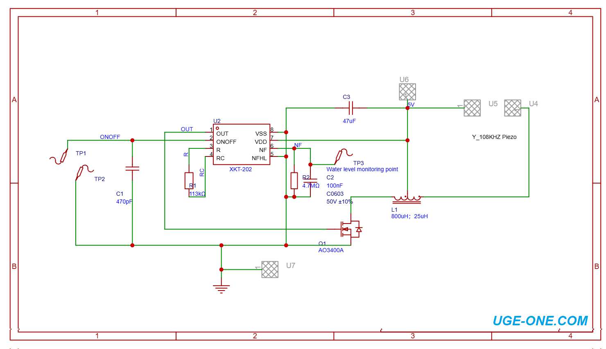

# XKT-202 Ultrasonic Atomizer Driver

Compact **DIY PCB** for building a small ultrasonic mist generator, humidifier, or atomizer around the **XKT-202** controller IC. The board drives a **108 kHz** piezoelectric atomizing transducer through a MOSFET + resonant inductor stage and includes **water-level detection** so the drive can stop when water is insufficient.

  

Available as a **fully assembled module** or as an **empty PCB** for DIY soldering. Designed by [UGE Electronics](https://uge-one.com/).

## Buy options

- Full assembled module: [Buy here](https://uge-one.com/?s=XKT-202+assembled&post_type=product)
- Empty PCB for DIY soldering: [Buy here](https://uge-one.com/product/xkt-202-ultrasonic-atomizer-driver-bare-pcb-108khz-water-level-detection-diy/)

Product page: [XKT-202 Ultrasonic Atomizer Driver Bare PCB](https://uge-one.com/product/xkt-202-ultrasonic-atomizer-driver-bare-pcb-108khz-water-level-detection-diy/)

## Assembly guide

GitHub’s file view shows HTML as source. Open the **rendered** guide here:

- **[Assembly guide (opens in browser)](https://ugeelectronics.github.io/XKT-202-Ultrasonic-Atomizer/)** — soldering steps, BOM, connections, and wiring notes
- Source file in the repo: [`XKT202 humidifier.html`](XKT202%20humidifier.html)

## Key features

- Designed for the **XKT-202** ultrasonic atomizer controller IC (SOP-8)
- Approximately **108 kHz** ultrasonic operating frequency
- Built for ultrasonic humidifier / mist-maker applications
- **Water-level detection** with automatic dry-run / low-water protection via the XKT-202 control circuit
- External **MOSFET** switching stage + external **resonant inductor**
- Dedicated **Piezo+ / Piezo−** output pads
- Dedicated water-level monitoring test point (**TP3**)
- Compact PCB with clearly labeled power and signal connections
- Suitable for DIY soldering and prototyping

## Technical specifications

| Parameter | Specification |
| --- | --- |
| Controller IC | XKT-202 |
| IC package | SOP-8 |
| Application | Ultrasonic atomizer / humidifier |
| Typical operating voltage | 5 V |
| Supply range | 3.0–5.5 V* |
| Ultrasonic frequency | Approximately 108 kHz* |
| Typical atomizer power | 1.5–3 W* |
| Recommended piezo diameter | Approximately 16 mm* |
| Water detection | Supported |
| Output stage | MOSFET + resonant inductor |
| PCB type | DIY bare PCB (empty board) or assembled module |
| Power input | +5 V / GND |

\*Typical values for an XKT-202-based application. Actual frequency and power depend on the IC, piezoelectric disc, inductor, MOSFET, and component tolerances.

## PCB connections

| Marking | Function |
| --- | --- |
| +5V | Power input |
| GND | Power ground |
| Piezo+ | Piezoelectric atomizer connection |
| Piezo− | Piezoelectric atomizer connection |
| TP3 | Water-level monitoring point |
| ON/OFF (TP1/TP2) | Enable / control connection |
| TP1 / TP2 | Circuit test / sensing points |

## Main components

| Reference | Component |
| --- | --- |
| U2 | XKT-202 ultrasonic atomizer controller |
| Q1 | AO3400A N-channel MOSFET |
| L1 | Resonant inductor (tapped, typically ~25 µH / ~800 µH) |
| R1 | 113 kΩ resistor |
| R2 | 4.7 MΩ resistor |
| C1 | 470 pF capacitor |
| C2 | 100 nF capacitor |
| C3 | 47 µF capacitor |
| Piezo pads | 108 kHz piezoelectric atomizer connection |
| TP1–TP3 | Test / water-level monitoring points |

Related parts on [uge-one.com](https://uge-one.com/):

- [XKT-202 IC (SOP-8)](https://uge-one.com/product/xkt-202-108khz-humidifier-atomizer-controller-with-water-sensing-cutoff-ic-sop8/)
- [16 mm / 108 kHz ceramic atomizer head](https://uge-one.com/product/16mm-108khz-universal-humidifier-atomizer-ceramic-ultrasonic-head/)
- [CD75 25/800 µH boost atomization inductor](https://uge-one.com/product/cd75-3-pin-smd-boost-atomization-humidifier-inductor-25800uh/)

## How it works

The XKT-202 generates the control signal for ultrasonic atomization and drives the **AO3400A** MOSFET. Together with the resonant inductor and piezoelectric transducer, that stage produces the ultrasonic excitation needed for mist generation.

A sensing path on **TP3 / NF** provides water-level monitoring. When sensing conditions indicate insufficient water, the controller can stop the atomizer drive to help prevent dry operation.

## Schematic

  

- Schematic file: [`Module_Schematic.png`](Module_Schematic.png)
- PCB render: [`XKT-202 PCB.jpg`](XKT-202%20PCB.jpg)

## Typical applications

- DIY USB humidifiers
- Mini ultrasonic humidifiers
- Aroma diffusers
- Small mist generators / portable humidifiers
- Water-level-controlled atomizers
- DIY cooling / misting projects
- Educational ultrasonic electronics projects
- Custom mist-making devices

## What’s included (bare PCB)

- 1 × XKT-202 Ultrasonic Atomizer Driver bare PCB

**Not included** on the empty PCB: XKT-202 IC, AO3400A, resonant inductor, piezoelectric disc, resistors, capacitors, wires/connectors, or power supply. All must be sourced and soldered by the user (or buy the assembled module).

## DIY assembly notes

1. Populate the PCB using the [assembly guide](XKT202%20humidifier.html) and schematic.
2. Verify component values, MOSFET orientation, and inductor pinout before applying power.
3. Connect a suitable **5 V** regulated supply to **+5V / GND**.
4. Connect a compatible **108 kHz** piezoelectric atomizer disc to **Piezo+ / Piezo−**.
5. Use water-level sensing (**TP3**) as intended — do not run the atomizer dry.

## Important notes

- The bare PCB is **not** a ready-to-use atomizer until components are installed.
- Use a piezoelectric disc matched to the intended operating frequency (~108 kHz).
- Use a suitable regulated power supply (typical 5 V).
- The PCB does not include a USB connector unless you add one yourself.
- Never operate without appropriate water-level protection.

## License

This project is released under the [MIT License](LICENSE).

Copyright (c) 2026 UGE Electronics
